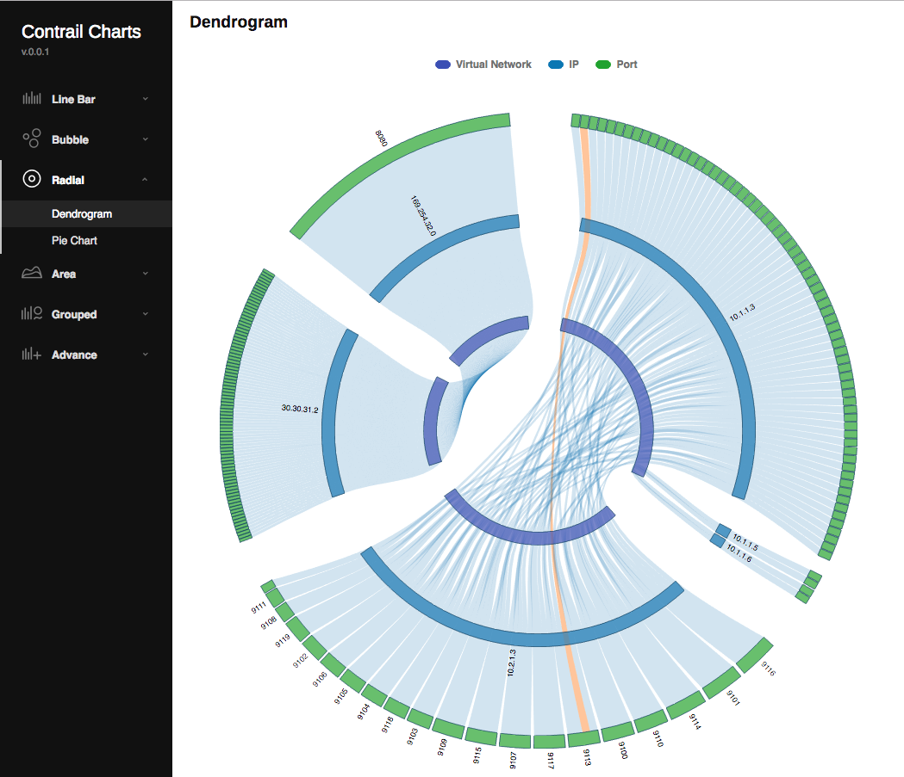
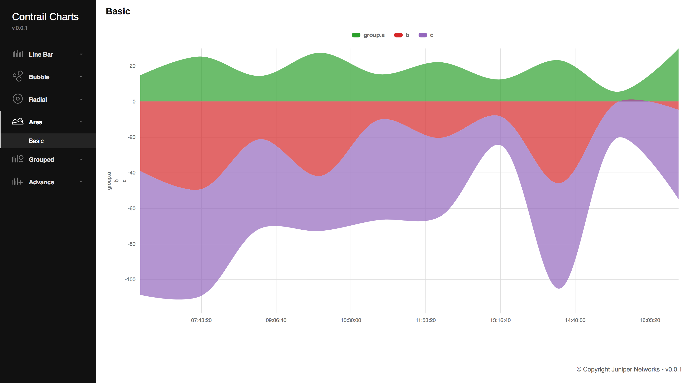
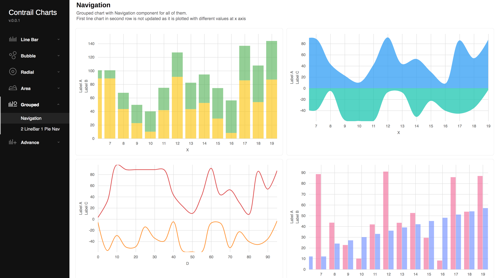

## Contrail Charts

A chart library by Contrail using D3 and Backbone. Please see [contrail-charts-demo](https://github.com/Juniper/contrail-charts-demo) for more examples using this library.

### Getting Started

#### Prerequisites

Node version > 6

#### Installation

If you are using NPM, use

`npm install contrail-charts`

Otherwise, download the latest release and run the following command. 

These instructions will get you a copy of the project up and running on your local machine for development and testing purposes.  

`npm install`

To build, use

`npm run build`

You'll find the `js` and `css` under `build/` directory. 

#### Development

For dev environment, use

`npm run dev`

This will build and load the examples on browser at [http://localhost:9000](http://localhost:9000).

To run unit tests, use

`npm run test`

Under CI infrastructure, we use phantomjs. If you want to run under headless browser: 

`npm install -g phantomjs-prebuilt` and do `npm run test-headless`

#### Documentation

Refer [documentation](https://github.com/Juniper/contrail-charts/wiki) for different types of charts, components and 
their config options. 

### Examples

#### Line Bar Chart

#### Radial Dendrogram Chart

#### Area Chart

#### Bubble Chart

#### Bubble Map

#### Grouped Chart

#### Sankey Chart

### Authors

* [Adrian Dmitra](https://github.com/Dmitra)
* [Daniel Osman](https://github.com/danielosman)
* [Sarin Kizhakkepurayil](https://github.com/skizhak)
* [Zheyang Song](https://github.com/ZheyangSong)
* [Abhishek Singla](https://github.com/absingla)

### License

This project is licensed under Apache Version 2.0 - see the [LICENSE](LICENSE) file for details

### Contribution

* Sign the [Contributor License Agreement](https://na2.docusign.net/Member/PowerFormSigning.aspx?PowerFormId=cf81ffe2-5694-4ad8-9d92-334fc57a8a7c)

* Guidelines for commit logs

    * Start commit message with a short (~50 characters) 1-line summary paragraph i.e. a single very brief line followed by a blank line. Rest of the commit log can be zero or more paragraphs. Each line within a paragraph should be <= 72 characters.

    * Include a Github issue number by adding Closes #NNN. For more details please read Github [help](https://help.github.com/articles/closing-issues-via-commit-messages/). 